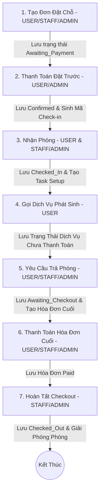

# BÁO CÁO PHÂN TÍCH VÀ ĐÁNH GIÁ LUỒNG NGHIỆP VỤ ĐẶT CHỖ (BOOKING FLOW)

## 1. Phân Tích Luồng Nghiệp Vụ Chuẩn (Happy Path)

Quy trình hoạt động tiêu chuẩn từ lúc tạo đơn đặt chỗ cho đến khi hoàn tất trả phòng được thực hiện qua các bước tuần tự sau:



### Các điểm dữ liệu đầu vào (Input) và đầu ra (Output) của từng bước:

1. **Tạo Đơn Đặt Chỗ (Create Booking)**
   * **Input:** `AssetId` (Không gian), `LayoutId` (Sơ đồ bố trí), `StartTime` (Giờ bắt đầu), `EndTime` (Giờ kết thúc), `CustomerName`/`CustomerPhone` (Chỉ điền nếu do Staff/Admin đặt hộ), `SnapshotBasePrice`, `SnapshotPriceModifier` (Phí phụ trội sơ đồ).
   * **Output:** Bản ghi Booking với trạng thái `Awaiting_Payment`, `PaymentDeadline` = `Thời gian hiện tại + 10 phút`.

2. **Thanh Toán Đặt Trước (Confirm Prepayment)**
   * **Input:** `BookingId` (ID đơn đặt chỗ).
   * **Output:** Cập nhật trạng thái Booking sang `Confirmed`, sinh mã `CheckInVerificationCode` ngẫu nhiên 6 chữ số, tự động tạo một nhiệm vụ dọn dẹp/bố trí phòng `InternalTask` (Logistics) với trạng thái `Unassigned`.

3. **Nhận Phòng (Check-in)**
   * **Yêu cầu mã (Khách hàng):** Gọi API `RequestCheckin` để nhận mã `CheckInVerificationCode`.
   * **Xác nhận check-in (Staff/Admin):** Nhận mã từ khách hàng, gọi API `CheckinBooking` kèm tham số `code`.
   * **Output:** Trạng thái Booking chuyển thành `Checked_In`, lưu `CheckedInAt` (thời điểm check-in thực tế), xóa `CheckInVerificationCode` khỏi DB để bảo mật.

4. **Sử dụng Dịch Vụ Phát Sinh (Incurred Services)**
   * **Input:** `BookingId`, danh sách dịch vụ `ServiceId` kèm `Quantity` trong quá trình sử dụng không gian.
   * **Output:** Bản ghi `BookingServiceDetail` được tạo với cờ `IsIncurred = true` và `PaymentStatus = "Unpaid"`.

5. **Yêu Cầu Trả Phòng (Request Checkout)**
   * **Input:** `BookingId` (đơn phải ở trạng thái `Checked_In`).
   * **Output:** Trạng thái Booking đổi sang `Awaiting_Checkout`. Hệ thống tự động tạo hoặc cập nhật hóa đơn cuối `Invoice` (Loại `Final`), tính tổng số tiền thực tế phát sinh, trong đó `FinalDue` (số tiền còn nợ) = Tổng tiền dịch vụ phát sinh chưa trả.

6. **Thanh Toán Hóa Đơn Cuối (Pay Final)**
   * **Input:** `BookingId`.
   * **Output:** Đổi trạng thái của `Invoice` sang `Paid`, đồng thời đổi toàn bộ trạng thái thanh toán của các dịch vụ phát sinh liên quan trong `BookingServiceDetail` sang `Paid`.

7. **Xác Nhận Checkout (Confirm Checkout)**
   * **Input:** `BookingId` (đơn phải ở trạng thái `Awaiting_Checkout`, hóa đơn cuối phải là `Paid`).
   * **Output:** Đổi trạng thái Booking sang `Checked_Out`, hoàn tất quy trình và giải phóng không gian để sẵn sàng cho khách tiếp theo.

---

## 2. Xác Định Các Trường Hợp Ngoại Lệ & Lỗi (Exception & Edge Cases)

### Lỗi dữ liệu / Hệ thống:
1. **Trùng lịch do xung đột đồng thời (Race Condition/Double Booking):**
   * *Kịch bản:* Hai người dùng cùng thực hiện đặt chung một phòng, cùng một khung giờ tại cùng một thời điểm (mili-giây). Do cơ chế kiểm tra `overlappingBooking` bằng Linq bất đồng bộ diễn ra song song trước khi ghi vào Database, cả hai yêu cầu đều vượt qua bước validate kiểm tra trùng lịch và cùng được lưu vào cơ sở dữ liệu.
   * *Giải pháp:* Thiết lập `Transaction` với mức cô lập `Serializable` hoặc sử dụng cơ chế Khóa bi quan (`Pessimistic Locking` / `SELECT ... FOR UPDATE` trong SQL) để khóa tài nguyên `SpaceAsset` trong suốt quá trình kiểm tra trùng và chèn dữ liệu mới. Bổ sung Unique Constraint hỗn hợp `(AssetId, StartTime, EndTime)` loại trừ trạng thái `Cancelled` nếu hệ thống hỗ trợ Index lọc (Filtered Index).
2. **Lỗi lệch múi giờ giữa Frontend và Backend (Timezone Mismatch):**
   * *Kịch bản:* Frontend gửi chuỗi thời gian dạng UTC ISO 8601 (ví dụ: `2026-07-16T09:00:00Z` biểu thị 9:00 AM UTC, tức 16:00 chiều Việt Nam). Tuy nhiên, Backend lại so sánh trực tiếp mốc này với `TimeHelper.GetVietnamTime()` (trả về thời gian cục bộ của Việt Nam dạng UTC+7 nhưng kiểu `Kind` là `Unspecified` hoặc `Local`). Kết quả so sánh toán học `dto.StartTime <= GetVietnamTime()` sẽ so sánh giá trị số 9 (giờ UTC) với số 10 (giờ hiện tại của VN) và báo lỗi "Thời gian không hợp lệ" dù thực tế giờ đặt cách thời gian hiện tại 6 tiếng. Lỗi này cũng làm sai lệch hoàn toàn logic kiểm tra thời gian hết hạn phòng khi Check-in và Checkout.
   * *Giải pháp:* Đồng bộ hóa toàn bộ ứng dụng sang múi giờ UTC. Cả Frontend và Backend chỉ lưu trữ và trao đổi dữ liệu dạng UTC. Khi hiển thị hoặc so sánh thời gian hiện tại, chuyển đổi tất cả về cùng một hệ chuẩn (`DateTime.UtcNow`).

### Ràng buộc nghiệp vụ chéo:
1. **Khách hàng không tới nhận phòng (No-Show Case):**
   * *Kịch bản:* Đơn đặt phòng đã được thanh toán (`Confirmed`) nhưng khách hàng không tới check-in. Lịch đặt phòng đó vẫn được giữ nguyên trạng thái `Confirmed` mãi mãi, khiến phòng bị block vô thời hạn, gây tổn thất doanh thu.
   * *Giải pháp:* Viết một Background Service (tương tự như `BookingTimeoutService`) để quét định kỳ. Nếu thời gian hiện tại vượt quá `StartTime` của booking quá 30 phút mà trạng thái vẫn là `Confirmed` (chưa chuyển sang `Checked_In`), tự động chuyển trạng thái booking sang `No_Show`, giải phóng phòng và tạo log phạt/hủy cọc tùy chính sách.
2. **Khách hàng không chịu Checkout / Sử dụng quá giờ (Overtime Case):**
   * *Kịch bản:* Đơn đặt phòng có giờ kết thúc là 11:00. Khách hàng sử dụng đến 11:30 mới gửi yêu cầu Checkout. Hiện tại hệ thống không tính phí phát sinh cho việc sử dụng quá giờ này.
   * *Giải pháp:* Tại API `/request-checkout`, so sánh thời gian thực tế gửi yêu cầu với `EndTime` của đơn đặt. Nếu vượt quá thời gian đệm cho phép (ví dụ: 15 phút), tự động tính thêm phụ thu quá giờ (Overtime Fee = Số phút quá giờ $\times$ Đơn giá mỗi phút của phòng) và cộng trực tiếp vào hóa đơn cuối `Invoice.FinalDue`.
3. **Thay đổi thông tin Layout sau khi đã thanh toán:**
   * *Kịch bản:* Đơn hàng đã ở trạng thái `Confirmed`, nhân viên muốn thay đổi Layout sắp xếp bàn ghế dẫn đến thay đổi thời gian setup và phí phụ trội nhưng task setup cũ đã được tạo.
   * *Giải pháp:* Khóa chức năng chỉnh sửa Layout sau khi trạng thái đơn đặt đã chuyển sang `Confirmed` hoặc `Checked_In`. Mọi thay đổi sau đó phải được thực hiện bởi Admin thông qua việc hủy đơn cũ và tạo đơn mới, hoặc có luồng cập nhật phụ phí riêng.

### Phân quyền & Bảo mật:
1. **Lỗ hổng phân quyền API Xóa đơn đặt chỗ (`DeleteBooking`):**
   * *Kịch bản:* API `DeleteBooking` trong `BookingsController.cs` không có thuộc tính `[Authorize]` ở mức phương thức (mặc dù class có `[Authorize]`). Tuy nhiên, nếu một người dùng đăng nhập bằng tài khoản không có quyền cụ thể, hoặc hệ thống phân quyền bị bỏ qua, họ có thể gửi request xóa bất kỳ đơn đặt chỗ nào miễn là đơn đó có trạng thái `Cancelled`.
   * *Giải pháp:* Bổ sung thuộc tính phân quyền rõ ràng `[Authorize(Roles = "ADMIN")]` cho hành động xóa lịch đặt để tránh người dùng thường hoặc STAFF tự ý can thiệp vào dữ liệu lịch sử đặt chỗ của hệ thống.
2. **Rò rỉ dữ liệu qua API Lấy danh sách đặt chỗ (`GetBookings`):**
   * *Kịch bản:* API `GetBookings` không được cấu hình cụ thể vai trò truy cập. Nếu người dùng đăng nhập với vai trò không phải `USER` (ví dụ: `STAFF` hoặc một vai trò mới được thêm vào hệ thống sau này), bộ lọc `if (userRole == "USER")` sẽ bị bỏ qua và trả về toàn bộ danh sách đặt chỗ của tất cả khách hàng trong hệ thống.
   * *Giải pháp:* Giới hạn quyền rõ ràng bằng cách cấu hình `[Authorize(Roles = "USER,STAFF,ADMIN")]`. Đồng thời viết rõ ràng:
     ```csharp
     if (userRole == "USER") {
         query = query.Where(b => b.UserId == userId);
     } else if (userRole == "STAFF" || userRole == "ADMIN") {
         // Được quyền xem toàn bộ hoặc lọc theo chi nhánh/không gian quản lý
     } else {
         return Forbid();
     }
     ```

---

## 3. Đánh Giá Điểm Nghẽn Logic (Logic Gaps)

| Điểm Nghẽn Hiện Tại (Mơ Hồ / Thiếu Định Nghĩa) | Tác Hại Đối Với Hệ Thống | Logic Xử Lý Cụ Thể Đề Xuất |
| :--- | :--- | :--- |
| **1. Hạn thanh toán cố định 10 phút:**<br>Khi tạo đơn đặt, `PaymentDeadline` luôn được gán bằng `Now + 10 phút`. | Nếu khách hàng đặt lịch sát giờ (ví dụ: đặt phòng họp bắt đầu sau 5 phút nữa), hạn thanh toán 10 phút sẽ vượt quá thời gian bắt đầu sử dụng phòng. Khách hàng có thể vào phòng sử dụng mà chưa thanh toán cọc. | Cải tiến công thức tính `PaymentDeadline` tại Backend:<br>`PaymentDeadline = Min(Now.AddMinutes(10), StartTime)` |
| **2. Không đồng bộ giữa Task Setup và Check-in:**<br>Hệ thống tự động sinh Task chuẩn bị phòng khi đơn được `Confirmed`, nhưng cho phép khách check-in bất kể Task setup đã xong hay chưa. | Khách hàng có thể check-in và vào phòng khi nhân viên chưa dọn dẹp hoặc bố trí layout xong, dẫn đến trải nghiệm dịch vụ tồi tệ. | Bổ sung ràng buộc logic:<br>- Thêm thuộc tính `IsSetupCompleted` vào `Booking` hoặc check trạng thái của `InternalTask` liên kết.<br>- Nếu Task setup chưa được đánh dấu hoàn thành, API check-in sẽ trả về cảnh báo lỗi: `"Không thể Check-in. Phòng hiện đang trong quá trình chuẩn bị."` (Trừ trường hợp được Admin phê duyệt đè). |
| **3. Không hỗ trợ hủy đơn đặt chỗ `Confirmed`:**<br>Chỉ cho phép xóa đơn ở trạng thái `Cancelled` (tức chưa thanh toán cọc quá hạn). | Khách hàng đã thanh toán cọc phòng nhưng có việc bận đột xuất không thể hủy lịch trên hệ thống, gây phiền hà và tăng tỷ lệ khiếu nại. | Xây dựng luồng Hủy lịch đặt (Cancel Booking):<br>- Thêm trạng thái `Cancelled_By_User` và `Cancelled_By_System`.<br>- Quy định chính sách hoàn tiền: Hủy trước $X$ giờ hoàn 100% cọc, hủy sát giờ phạt 100% cọc. |
| **4. Thiếu kiểm tra nợ xấu của khách hàng:**<br>Cho phép đặt đơn mới tự do khi có đơn cũ chưa thanh toán hóa đơn phát sinh. | Khách hàng cố tình sử dụng dịch vụ phát sinh (ví dụ: gọi đồ uống, thuê thêm thiết bị) rồi bỏ trốn không thanh toán hóa đơn cuối, sau đó vẫn tiếp tục đặt lịch mới. | Khi tạo đơn mới, kiểm tra danh sách đơn cũ của khách hàng đó. Nếu có bất kỳ đơn nào ở trạng thái `Checked_Out` nhưng còn hóa đơn chưa thanh toán (`PaymentStatus != "Paid"`), hệ thống chặn và thông báo: `"Tài khoản của bạn đang có hóa đơn chưa thanh toán. Vui lòng hoàn tất thanh toán trước khi đặt lịch mới."` |

---

## 4. Đề Xuất Check-list Kiểm Thử (Test Cases Specification)

| ID | Tên Kịch Bản (Scenario) | Loại Case | Điều kiện tiên quyết | Kết quả mong đợi (Expected Output) |
|---|---|---|---|---|
| **TC_B01** | Đặt phòng thành công với dữ liệu hợp lệ | Happy | Phòng trống, thời gian chọn ở tương lai. | Booking được tạo với trạng thái `Awaiting_Payment`, hạn thanh toán đúng 10 phút. |
| **TC_B02** | Đặt phòng trùng lịch (Double Booking) | Exception | Phòng đã có người đặt và đơn đó ở trạng thái `Confirmed` tại cùng khung giờ. | Hệ thống trả về lỗi `409 Conflict` kèm thông điệp báo trùng lịch và gợi ý chọn giờ khác. |
| **TC_B03** | Đặt phòng trùng lịch trong khoảng thời gian đệm (Setup Buffer) | Edge | Phòng A có lịch đặt từ 10h-12h. Lịch mới chọn từ 9h-10h15. Layout của lịch sau cần 20 phút setup. | Hệ thống chặn và báo trùng vì thời gian dọn phòng thực tế của đơn sau (bắt đầu từ 9h55) giao thoa với đơn trước. |
| **TC_B04** | Tự động hủy đơn đặt chỗ quá hạn thanh toán cọc | Exception | Booking ở trạng thái `Awaiting_Payment` và đã quá 10 phút kể từ lúc tạo. | Background service tự động đổi trạng thái sang `Cancelled`. |
| **TC_B05** | Check-in sớm hơn giờ đặt trước 2 tiếng bởi Staff | Exception | Đơn ở trạng thái `Confirmed`. Thời gian check-in sớm hơn giờ bắt đầu 2 tiếng 15 phút. Người thực hiện là `STAFF`. | Hệ thống từ chối check-in và báo lỗi: `"Check-in sớm hơn 2 tiếng cần có Admin xác nhận."` |
| **TC_B06** | Check-in sớm hơn giờ đặt trước 2 tiếng được phê duyệt bởi Admin | Edge | Đơn ở trạng thái `Confirmed`. Thời gian check-in sớm hơn giờ bắt đầu 2 tiếng 15 phút. Người thực hiện là `ADMIN`. | Hệ thống cho phép check-in, đổi trạng thái sang `Checked_In`, lưu `CheckedInByAdminId`. |
| **TC_B07** | Check-in khi đã quá giờ kết thúc của đơn đặt | Exception | Đơn ở trạng thái `Confirmed`. Thời gian hiện tại muộn hơn `EndTime` của booking. | Hệ thống từ chối check-in và trả về lỗi: `"Không thể check-in vì thời gian đặt chỗ đã kết thúc."` |
| **TC_B08** | Yêu cầu checkout khi có dịch vụ phát sinh chưa thanh toán | Happy | Đơn ở trạng thái `Checked_In`, có dịch vụ phát sinh `IsIncurred = true` chưa thanh toán. | Đơn chuyển sang `Awaiting_Checkout`. Tạo hóa đơn cuối với số tiền phải thu `FinalDue` tương ứng với tiền dịch vụ. |
| **TC_B09** | Cố tình hoàn tất checkout khi chưa thanh toán hóa đơn cuối | Exception | Đơn ở trạng thái `Awaiting_Checkout`, hóa đơn phát sinh chưa được thanh toán (`PaymentStatus = "Unpaid"`). | Hệ thống chặn không cho checkout, trả về lỗi: `"Chưa thanh toán hoàn thiện hóa đơn cuối. Không thể thực hiện checkout."` |
| **TC_B10** | Người dùng thường cố tình gọi API checkout của phòng người khác | Exception | Người dùng A đăng nhập, cố tình gọi API `/pay-final` hoặc `/request-checkout` của đơn đặt chỗ thuộc về Người dùng B. | Hệ thống chặn và trả về mã lỗi `403 Forbidden`. |

---

## 5. Bản Đồ Tính Năng & Logic Input/Output Chi Tiết (Feature & I/O Mapping)

| ID | Tính năng con (Hành động) | Tác nhân thực hiện (Actor) | Dữ liệu đầu vào (Input Data) | Logic xử lý & Quy tắc kiểm tra (Validation Rules/Business Logic) | Dữ liệu đầu ra (Output Data & Side Effects) |
| :--- | :--- | :--- | :--- | :--- | :--- |
| **F1.1** | Tạo lịch đặt chỗ mới | USER, STAFF, ADMIN | - `AssetId`<br>- `LayoutId`<br>- `StartTime` & `EndTime`<br>- `CustomerName`/`CustomerPhone` (Staff đặt hộ) | 1. `StartTime` phải lớn hơn thời gian hiện tại.<br>2. `EndTime` phải lớn hơn `StartTime`.<br>3. Kiểm tra trùng lịch có tính đến thời gian setup của Layout.<br>4. Nếu là USER, tự động gán `UserId` từ Token. Nếu là STAFF/ADMIN, lấy `UserId` của khách được chọn hoặc dùng ID mặc định của khách vãng lai. | - Đơn đặt chỗ mới được lưu vào DB ở trạng thái `Awaiting_Payment`.<br>- Sinh `PaymentDeadline` = `Now + 10 phút`.<br>- Tạo bản ghi `BookingLog` ghi nhận hành động. |
| **F1.2** | Xác nhận thanh toán đặt trước (Prepayment) | USER, ADMIN | - `BookingId` | 1. Đơn hàng phải ở trạng thái `Awaiting_Payment` và chưa quá hạn thanh toán.<br>2. Người dùng phải có quyền sở hữu đơn hàng (USER) hoặc là ADMIN. | - Trạng thái đơn đặt chuyển sang `Confirmed`.<br>- Sinh ngẫu nhiên mã check-in 6 chữ số.<br>- Tự động tạo `InternalTask` loại `LOGISTICS` để nhân viên chuẩn bị phòng họp theo Layout yêu cầu. |
| **F1.3** | Quét tự động hủy đơn hết hạn cọc | Hệ thống (Background Service) | - Không có (Quét tự động mỗi 1 phút) | Quét tất cả các đơn có trạng thái `Awaiting_Payment` mà `PaymentDeadline` nhỏ hơn thời gian hiện tại. | - Đổi trạng thái đơn đặt sang `Cancelled`. |
| **F1.4** | Yêu cầu mã nhận phòng (Request Check-in Code) | USER, STAFF, ADMIN | - `BookingId` | 1. Trạng thái đơn phải là `Confirmed`.<br>2. Khách hàng sở hữu đơn (USER) hoặc STAFF/ADMIN. | - Trạng thái đơn đặt chuyển sang `Confirmed` và trả về mã check-in có sẵn trong DB (hoặc sinh mới nếu chưa có). |
| **F1.5** | Thực hiện Check-in tại quầy | STAFF, ADMIN | - `BookingId`<br>- `code` (Mã check-in khách cung cấp) | 1. Trạng thái đơn phải là `Confirmed`.<br>2. Thời gian hiện tại không được lớn hơn `EndTime`.<br>3. Mã check-in phải khớp.<br>4. Nếu check-in sớm hơn giờ bắt đầu quá 2 tiếng, bắt buộc tài khoản thực hiện phải có vai trò `ADMIN`. | - Trạng thái đơn chuyển sang `Checked_In`.<br>- Lưu thời điểm check-in thực tế `CheckedInAt` và ID người duyệt `CheckedInByAdminId` (nếu là Admin duyệt sớm).<br>- Xóa mã xác nhận check-in trong DB. |
| **F1.6** | Yêu cầu trả phòng (Request Checkout) | USER, STAFF, ADMIN | - `BookingId` | 1. Đơn đặt phòng phải đang ở trạng thái `Checked_In`. | - Đổi trạng thái đơn sang `Awaiting_Checkout`.<br>- Tạo hóa đơn cuối loại `Final` tổng hợp tiền phòng và các dịch vụ phát sinh chưa trả. |
| **F1.7** | Thanh toán hóa đơn cuối (Pay Final) | USER, STAFF, ADMIN | - `BookingId` | 1. Đơn hàng phải ở trạng thái `Awaiting_Checkout`.<br>2. Phải tồn tại hóa đơn loại `Final` cho đơn này. | - Đổi trạng thái hóa đơn `Final` sang `Paid`.<br>- Đổi trạng thái tất cả các dịch vụ phát sinh liên quan trong đơn sang `Paid`. |
| **F1.8** | Hoàn tất Checkout và giải phóng phòng | STAFF, ADMIN | - `BookingId` | 1. Đơn đặt phòng phải ở trạng thái `Awaiting_Checkout`.<br>2. Hóa đơn cuối của đơn đặt này phải ở trạng thái `Paid` (Không còn nợ). | - Đổi trạng thái đơn đặt sang `Checked_Out`.<br>- Giải phóng trạng thái phòng để hệ thống cho phép đặt lịch tiếp theo.<br>- Lưu log hoàn tất Checkout. |
